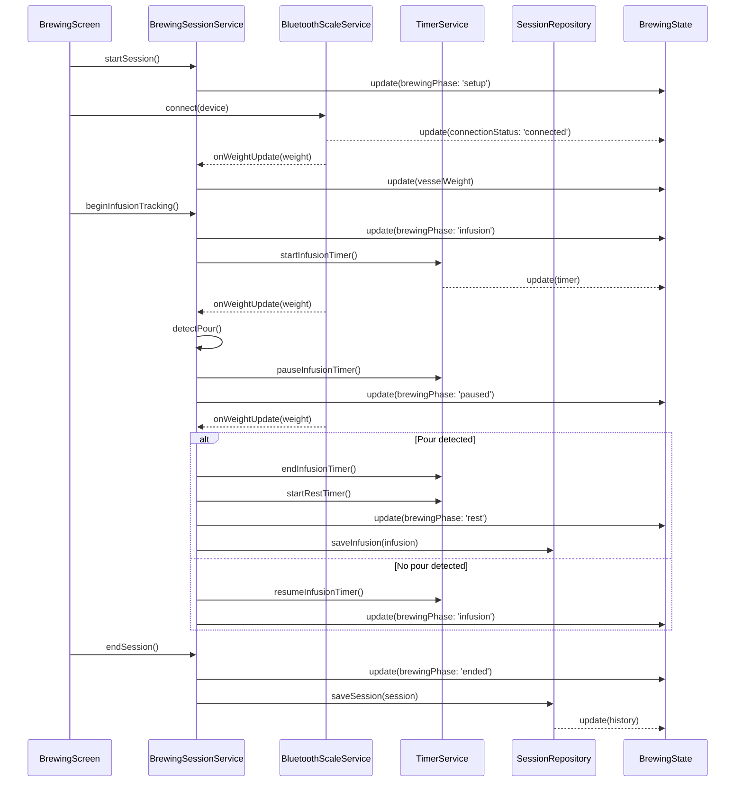

# Application Architecture

## Technology Stack

*   **Language:** TypeScript
*   **Cross-platform Framework** Capacitor
*   **UI:** Ionic Framework with React
*   **Database:** SQLite (via Capacitor Community SQLite) for local data storage. For browser environments, it uses an IndexedDB/SQLite shim.
*   **Bluetooth:** Use scale implementations from Beanconqueror (https://github.com/graphefruit/Beanconqueror/blob/master/src/classes/devices/bluetoothDevice.ts and classes in https://github.com/graphefruit/Beanconqueror/tree/master/src/classes/devices extending BluetoothScale) 
*   **Router** Use React router v5, newer versions of React router are not supported by ionic framework v7. See https://forum.ionicframework.com/t/is-ionic-v8-compatible-with-react-router-v6/243106

## Core Components

1.  **UI Layer (View)**
    *   **Screens:**
        *   `BrewingScreen`: The main interactive screen for tracking a live session.
        *   `HistoryScreen`: Displays the list of past sessions.
        *   `SessionDetailScreen`: Shows the details of a single past session.
        *   `SettingsScreen`: For user preferences.

1. **Data Layer (Repository)**
    *   Repositories will abstract the data sources.
    *   `SessionRepository`: Manages saving and retrieving brewing session data
    *   [Post-MVP] `TeaRepository`: Manages a library of teas, including tea names, types, brewing parameters, and user preferences for each tea
    *   `SettingsRepository`: Manages user preferences for scale configuration (tare behavior, sensitivity thresholds, minEndInfusionWeight) and timer preferences (sound/vibration alerts)

1. **Service Layer**
    *   **`BluetoothScaleService`:**
        *   **Implementation**: Implemented as a module-level singleton, exported from `src/services/index.ts`.
        *   **Device Discovery**: Manages device discovery by using `BleClient` to scan for advertising packets. It identifies scale types by iterating through `AVAILABLE_SCALES` and calling their static `test()` methods. Discovered devices are stored as `DiscoveredDevice` objects in the Zustand store.
        *   **Connection Management**: Handles the full connection lifecycle (`scanning`, `connecting`, `connected`, `disconnected`). It instantiates the correct `BluetoothScale` class for a given device and manages the underlying BLE connection via the `BleAdapter`.
        *   **Automatic Reconnection**: On unexpected disconnections, it automatically attempts to reconnect with an exponential backoff strategy (1s, 2s, 4s) for a maximum of 3 attempts.
        *   **Event Subscription**: Subscribes to RxJS Observables (`weightChange`, `tareEvent`, etc.) from the active `BluetoothScale` instance and updates the Zustand store accordingly.
        *   **Public API**:
            *   `startScan(): Promise<void>`
            *   `stopScan(): Promise<void>`
            *   `connect(deviceId: string): Promise<void>`
            *   `disconnect(): Promise<void>`
            *   `tare(): Promise<void>`
            *   `getConnectionStatus()`
            *   `getConnectedDevice()`
        *   **Note**: Preferred device persistence will be integrated in a future phase with `SettingsRepository`.
    *   **`BrewingSessionService`:**
        *   Session lifecycle management (start, pause, end)
        *   Automatic detection logic for vessel weight, lid weight, water addition, and tea pouring
        *   Infusion timer and rest timer management
        *   Infusion counter and weight tracking
        *   Integration with BluetoothScaleService for weight events
    *   **`TimerService`:**
        *   Managing infusion timers and rest timers with alert notifications
    *   **`WeightLoggerService`:**
        *   Records timestamped weight data during real brewing sessions for development and testing purposes
        *   **Responsibilities:**
            *   Capture weight updates from BluetoothScaleService with precise timestamps
            *   Store recordings as JSON time series with metadata (session name, date, scale device, settings)
            *   Provide export functionality for sharing recordings
            *   Manage recording lifecycle (start, stop, save)
        *   **Note:** This is a development tool that enables the mock scale replay functionality
    *   **`MockScaleService`:**
        *   Simulates BluetoothScaleService behavior by replaying recorded weight data, enabling hardware-free development and testing
        *   **Responsibilities:**
            *   Implement the same interface as BluetoothScaleService for seamless integration
            *   Load and parse recorded JSON time series data
            *   Emit weight updates at recorded timestamps (or scaled timestamps for fast-forward mode)
            *   Provide replay controls (start, pause, resume, restart, seek)
            *   Support playback speed multipliers (1x, 10x, 50x, 100x)
        *   **Note:** Integrates transparently with BrewingSessionService - no service layer changes needed when switching between real and mock scale

## Service Layer Patterns

*   **Singleton Services**: Services are implemented as module-level singletons. A single instance is created and exported from `src/services/index.ts`. This provides a single, shared entry point for all UI components and other services.
*   **Service-to-Store Integration**: Services are responsible for managing business logic and directly updating the Zustand store (e.g., via `useStore.setState()`). This keeps state mutations centralized and predictable.
*   **Clean Imports**: UI components and other services should import service instances directly from `src/services/index.ts` (e.g., `import { bluetoothScaleService } from '../services';`).

## Domain Models

- **BrewingSession model**: sessionId, teaId, teaName, startTime, endTime, vesselWeight, lidWeight, teaWeight, infusions array, notes, status (active/completed)
- **Infusion model**: infusionNumber, waterWeight, startTime, duration, restDuration, wetLeavesWeight
- **Tea model**: teaId, name, type, defaultBrewingParameters, notes
- **ScaleDevice model**: deviceId, name, address, isPreferred, lastConnected
- **Settings model**: scale configuration (tare behavior, sensitivity, minEndInfusionWeight), timer preferences (alerts enabled, sound/vibration)
- These models map to SQLite tables (or entities) for persistence, where each model corresponds to a table (e.g., BrewingSessionEntity for BrewingSession), with relationships handled via foreign keys (e.g., infusions linked to BrewingSession via sessionId, and BrewingSession linked to Tea via teaId).

## State Management

- The application uses a state management library (Zustand) for managing global application state, ensuring centralized and reactive updates across components.
- Key state slices include:
  - **BluetoothState**: connected device, connection status, current weight reading, available devices
  - **BrewingState**: active session, current infusion, timer status, brewing phase (setup/infusion/rest/ended)
  - **HistoryState**: cached session list, selected session details
  - **SettingsState**: user preferences and scale configuration
- State updates follow event-driven patterns: services (e.g., BluetoothScaleService, BrewingSessionService) update the store, triggering re-renders. UI components like BrewingScreen consume state via hooks (e.g., useStore) and update it through service calls, maintaining separation between view and business logic.

## Data Flow

- **Note on Data Flow:** The `MockScaleService` can be substituted for the `BluetoothScaleService` without any changes to the data flow, as it implements the same interface. This is a key part of the development strategy, allowing for hardware-free testing.

- **Flow from BluetoothScaleService receiving weight data to UI updates**:
  1. BluetoothScaleService receives BLE weight notifications
  2. Service publishes weight updates to BrewingSessionService
  3. BrewingSessionService analyzes weight changes against thresholds from Settings
  4. Service updates BrewingState based on detected events (water added, tea poured, vessel removed)
  5. State changes trigger UI re-renders in BrewingScreen
  6. TimerService responds to state changes to start/stop timers
- **Session persistence flow**:
  1. BrewingSessionService maintains in-memory session state
  2. On infusion completion, data is persisted via SessionRepository to SQLite
  3. On session end, complete session is saved and HistoryState is invalidated
  4. HistoryScreen queries SessionRepository to display past sessions

## Component Interaction Details

- **Bluetooth Scale Integration workflow**:
  - SettingsScreen initiates a device scan via `bluetoothScaleService.startScan()`.
  - The service uses `BleAdapter` to find devices. For each result, it tests against all `AVAILABLE_SCALES` to identify the device type.
  - The UI displays the list of available devices from the Zustand store.
  - User selects a device, and the UI calls `bluetoothScaleService.connect(deviceId)`.
  - The service establishes a connection and updates the store. Preferred device persistence will be handled by `SettingsRepository` in a future phase.
  - The service maintains the connection and handles automatic reconnections.
  - Weight data streams continuously to the Zustand store, which can then be consumed by `BrewingSessionService` or other parts of the application.

- **Automatic Session Tracking workflow aligned with FEATURES.md GongFu process**:
  - **Setup Phase**: User starts session in BrewingScreen, places vessel on scale → BrewingSessionService detects stable weight and records vesselWeight
  - **Lid Detection**: User removes lid → service detects weight decrease and records lidWeight (vesselWeight - currentWeight)
  - **Tea Weighing**: User adds tea → service tracks weight increase for teaWeight
  - **Infusion Start**: User presses button to begin infusion tracking
  - **Water Addition**: Service detects significant weight increase (above sensitivity threshold) → automatically starts infusion timer and records waterWeight
  - **Lid Handling During Infusion**: Service ignores small weight changes matching lidWeight to allow lid addition/removal without affecting timer
  - **Vessel Removal**: Service detects vessel removal (weight drops to near zero) → pauses timer but doesn't stop it, saves current duration
  - **Vessel Return & Pour Detection**: When vessel returns, service checks if weight decreased by minEndInfusionWeight → if yes, ends infusion timer, saves infusion data (duration, waterWeight), increments infusion counter, and proceeds to post-infusion steps.
    - If the weight decrease is below `minEndInfusionWeight`, the infusion timer resumes from its paused duration.
  - **Post-Infusion**:
    - `BrewingSessionService` captures and stores `wetLeavesWeight` (current weight minus vessel and lid weights) for the completed infusion.
    - A rest timer is started.
  - **Rest Phase**: Service tracks rest timer, allows vessel and lid manipulation without timer interference
  - **Next Infusion**: Service detects new water addition → stops rest timer, saves restDuration, starts new infusion timer
  - **Session End**: User presses end button → BrewingSessionService finalizes session, persists complete data via SessionRepository

- **Error handling and edge cases**:
  - Bluetooth disconnection during active session (pause session, attempt reconnection)
  - Ambiguous weight changes (use configurable thresholds and debouncing)
  - Manual override capabilities (user can manually start/stop timers if automatic detection fails)
